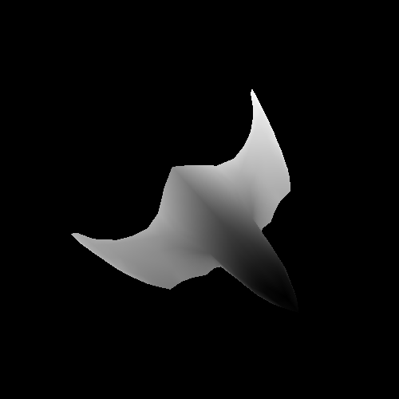
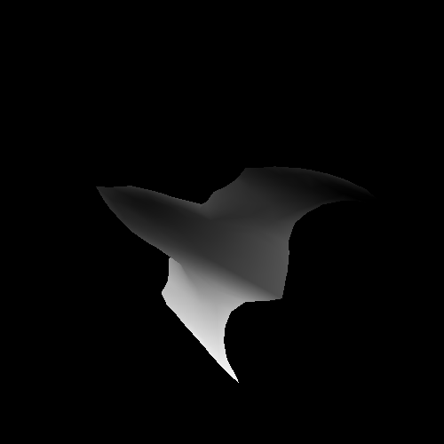
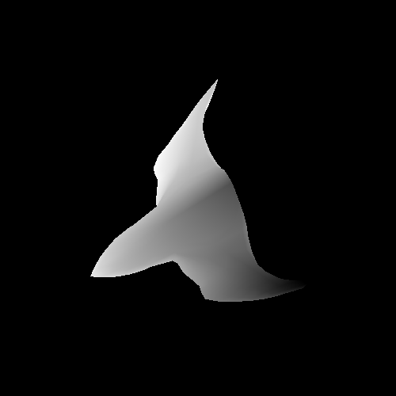
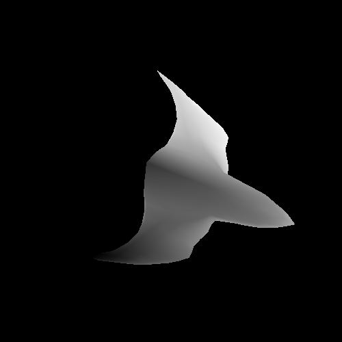

# SR-2-Flat-Shading

Este proyecto, titulado "SR-2-Flat-Shading", es una implementación de un renderizador por software que puede cargar y renderizar modelos 3D en tonalidades de gris usando la técnica de Flat Shading. Este método considera una fuente de luz uniforme y sombrea cada triángulo de un objeto con un solo color, lo que resulta en una apariencia distintiva y estilizada.

## Imágenes
<table>
  <tr>
    <td></td>
    <td></td>
  </tr>
  <tr>
    <td></td>
    <td></td>
  </tr>
</table>

## Técnica de Flat Shading y Renderización
El Flat Shading es un método de sombreado en gráficos 3D donde cada polígono se colorea con un tono único, basado en la orientación del polígono respecto a la fuente de luz y la cámara. Este enfoque es más simple y menos realista en comparación con técnicas como el Smooth Shading, pero es computacionalmente eficiente y ofrece un estilo visual característico. En este proyecto, se aplica Flat Shading para renderizar modelos 3D de una manera que destaca la geometría y la estructura de los objetos.

## Estructura del Proyecto

- `main.cpp`: Archivo principal que contiene la lógica de renderizado y manejo de eventos.
- `CMakeLists.txt`: Configuración de CMake para compilar el proyecto.
- `GraphicsStructures.h`: Define las estructuras necesarias para la representación gráfica, como color, vértices y fragmentos.
- `ShaderUtilities.h`: Contiene las implementaciones del sombreador de vértices y fragmentos, y funciones auxiliares.
- `ObjLoader.h`: Funciones para cargar modelos 3D desde archivos `.obj`.
- `spaceship.obj`: Modelo 3D utilizado para la demostración.
- `Spaceship.bmp`, `Spaceship1.bmp`, `Spaceship2.bmp`, `Spaceship3.bmp`: Imágenes de salida del renderizador.

## Uso

1. Clone este repositorio en su máquina local.
2. Asegúrese de tener instaladas las bibliotecas SDL2 y GLM.
3. Navegue al directorio del proyecto y cree un directorio de compilación: `mkdir build && cd build`.
4. Compile el proyecto con CMake: `cmake .. && cmake --build .`.
5. Ejecute el programa: `./SR_2_Flat_Shading`.
6. Las imágenes renderizadas se guardarán como archivos `.bmp` en la carpeta del proyecto.

## Autor
- [Javier Ramírez]
